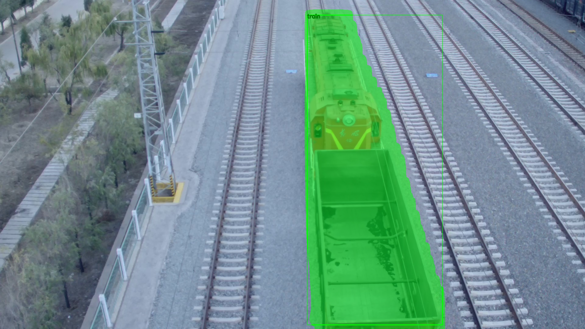
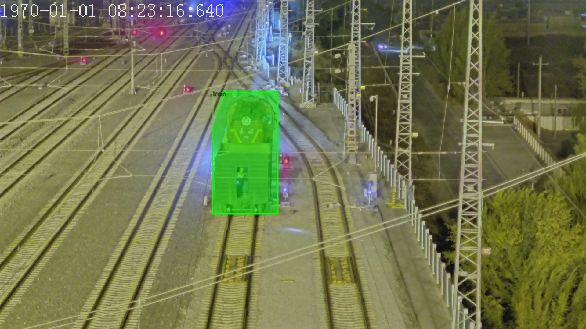
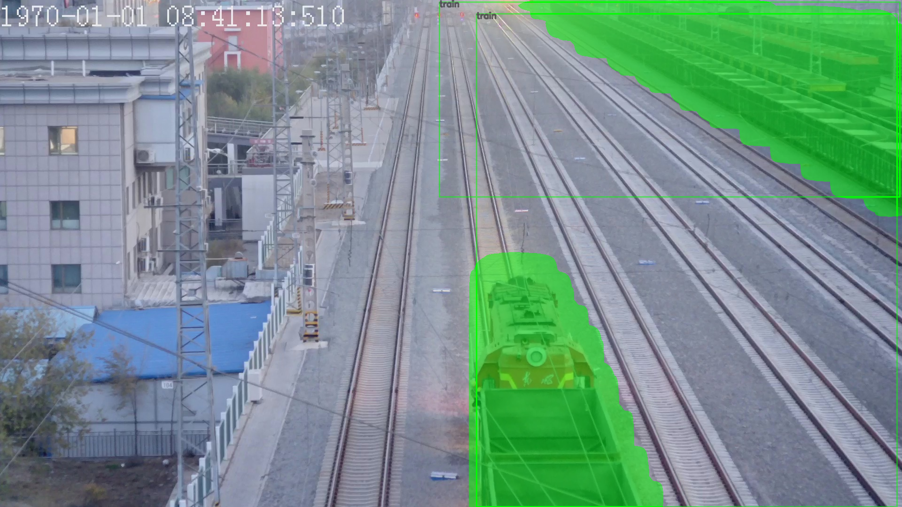
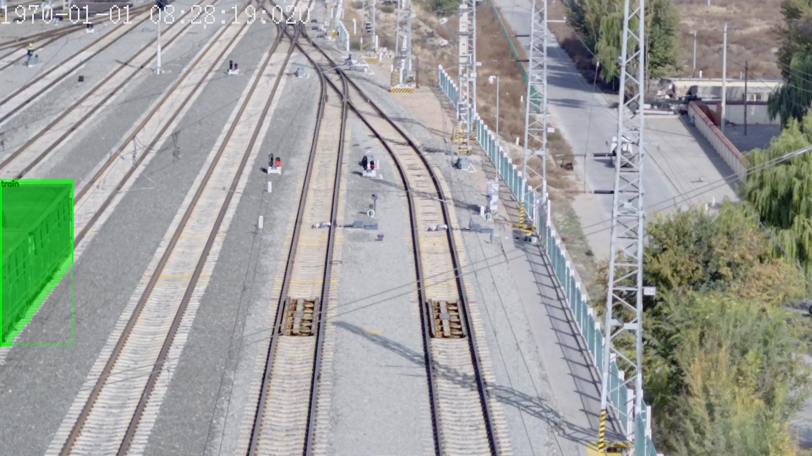

Using Torchvision for Train Instance Segmentation
--

### Env Configuration(win 10)
#### Setup Conda Env
```
conda create --name maskrcnn
conda activate maskrcnn
```
 
```
conda config --add channels https://mirrors.tuna.tsinghua.edu.cn/anaconda/pkgs/free/
conda config --add channels https://mirrors.tuna.tsinghua.edu.cn/anaconda/pkgs/main/
conda config --add channels https://mirrors.tuna.tsinghua.edu.cn/anaconda/cloud/menpo/
conda config --add channels https://mirrors.tuna.tsinghua.edu.cn/anaconda/cloud/bioconda/
conda config --add channels https://mirrors.tuna.tsinghua.edu.cn/anaconda/cloud/conda-forge/
conda config --add channels https://mirrors.tuna.tsinghua.edu.cn/anaconda/cloud/msys2/
conda config --add channels https://mirrors.tuna.tsinghua.edu.cn/anaconda/cloud/pytorch/
```
#### Install pytorch & cuda
```
conda install pytorch torchvision cudatoolkit=10.0
```

**tips**: if pycocotools can not successfully be installed, download *.whl from
https://pypi.tuna.tsinghua.edu.cn/simple/pycocotools-windows/
```
pip install /path/to/pycocotools_windows_xxxx.whl
```

### DIY Dateset Processing
convert your own dateset from labelme format to PennFudanPed format
you can reference to this video:
https://www.bilibili.com/video/BV1R7411F7QP

1. Put your *.jpg files and json files together in one file after annotating, then run
```
python new_json_to_dataset.py path/to/original/dataset
```

2. Extract png and gth  
put copy.py together with *.jpg and json, then run
```
python copy.py
```

3. Copy your pngs and masks into PennFudanPed2/PNGImages ans PennFudanPed2/PedMasks manually


### Getting started
1. before training, edit the parameters on *line 141, 184, 185* in train.py to your needs. 
* names = {'0': 'background', '1': 'train'}
* num_classes = 2  
* train_num = 1200  

2. Start training
```
python train.py
```

### Predict
before predicting, editing the same params as training.
```
python predict.py
```

### Result






